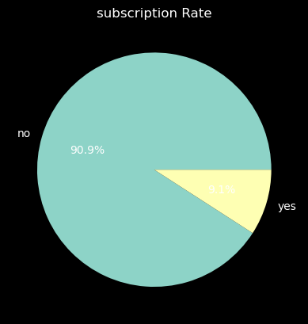
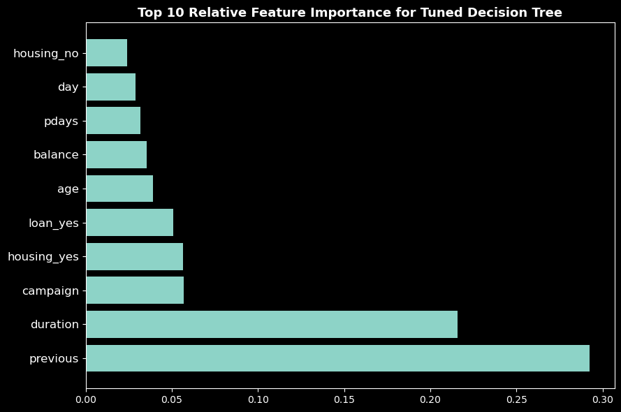

# CUSTOMER PURCHASE PREDICTION 
 

## Project Description

In this project, I aim to build a decision tree classifier to predict whether a customer will purchase a product or service based on their demographic and behavioral data. I will use a dataset from the UCI Machine Learning Repository, which contains information such as age, job, marital status, education, balance, and various other features about the customers. The goal is to develop a predictive model that can assist marketing efforts by identifying potential customers who are more likely to make a purchase  

## Business Understanding  

The project is important for businesses, especially in the marketing and sales domain, as it can help in targeting potential customers more effectively. By identifying customers who are likely to make a purchase, businesses can optimize their marketing strategies, allocate resources efficiently, and ultimately increase their conversion rates and revenue.   
 
 ## Data Understanding  
 
The dataset i obtained from UCI Machine Learning Repository website: [Bank Marketing](https://archive.ics.uci.edu/dataset/222/bank+marketing)  
 
The dataset contains the following columns:    

``age``: Age of the customer.   
``job``: Occupation of the customer.    
``marital``: Marital status of the customer.     
``education``: Education level of the customer.  
``default``: Whether the customer has credit in default (yes/no).  
``balance``: Average yearly balance in euros.   
``housing``: Whether the customer has a housing loan (yes/no).  
``loan``: Whether the customer has a personal loan (yes/no).   
``contact``: Type of communication used to contact the customer.  
``day``: Last contact day of the month.   
``month``: Last contact month of the year.   
``duration``: Duration of the last contact in seconds.   
``campaign``: Number of contacts performed during this campaign.   
``pdays``: Number of days since the customer was last contacted.   
``previous``: Number of contacts performed before this campaign.   
``poutcome``: Outcome of the previous marketing campaign.   
``y``: Whether the customer subscribed to a term deposit (yes/no).    

## EXPLORATORY DATA ANALYSIS 
#### Subscription rate 

The dependent variable would typically be "y," which represents whether the customer subscribed to a term deposit. This variable indicates the binary outcome of interest: whether a customer made a specific decision or took a specific action, in this case, subscribing to a term deposit or not 

* Approximately 90.9% of the customers did not subscribe to a term deposit, while the remaining did subscribe.  
* Knowing that only a small percentage of customers subscribed, marketing campaigns could focus on identifying and targeting specific customer segments that are more likely to subscribe

## MODELING
* Baseline Model - Decision Tree Classifier
* Second Model - Hyperparameter tuning of Decision Tree Classifier 
## MODEL EVALUATION
The tuned model maintains a high level of performance on both training and test data, indicating better generalization.
The tuned model achieves a better balance between precision and recall, making it more suitable for real-world applications  
The tuned model performs better than the baseline model because it provides a more balanced trade-off between different evaluation metrics and is less likely to overfit to the training data 
### Most Important Features
 
Most Important Features are:
*  Previous Contacts (previous)
* Duration of Last Contact (duration)
* Number of Contacts in the Current Campaign (CAMPAIGN)

## RECOMMENDATIONS    
* Leverage Previous Contacts: Focus marketing efforts on customers who have been contacted before, as they are more likely to subscribe. Build on these existing relationships to increase conversions.
* Engage in Longer Conversations: Encourage customer interactions with longer and more engaging conversations during contact. This can be achieved by providing valuable information and addressing their needs 
* Be cautious about over-contacting customers during a single campaign. Instead, adopt a more balanced and targeted approach to avoid overwhelming potential subscribers 
* It may be beneficial to tailor communication strategies for shorter and longer call durations. Shorter calls could focus on concise messaging, while longer calls might involve more detailed discussions 
* Marketing strategies can be tailored based on job categories. For instance, promotions or messaging can be customized to appeal to specific professional groups. 
* To improve subscription rates, marketing strategies could be adjusted to target customers with higher education levels more effectively. Tailoring campaigns or promotions to appeal to customers with "tertiary" education might be a successful approach
* marketing strategy that focuses on shorter and more effective interactions during the last contact may be more successful in achieving subscriptions. It's essential to identify and target customers within the subscriber cluster
* To improve subscription rates, marketers should consider optimizing their campaign strategies. Instead of increasing the number of contacts, they could concentrate on tailoring their messages and interactions to be more compelling and relevant to the custome

AUTHOR:         
Mohammed Suhail : mohammedsuhails2004@gmail.com

👉 [LinkedIn](https://www.linkedin.com/in/mohammed-suhail-s-273492281)

👉 [GitHub](https://github.com/Suhail786444)
